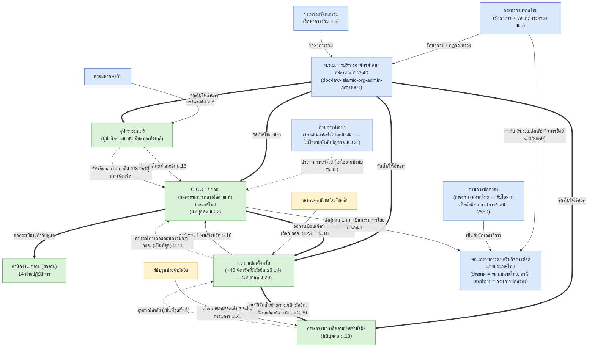

# โครงสร้าง CICOT และความสัมพันธ์กับภาครัฐ / CICOT Structure & State Relationship

> **สถานะเอกสารนี้**: สังเคราะห์จากเอกสารที่ ingest แล้วในระบบนี้ (พ.ร.บ.2540 + ระเบียบ กอท. 9 ฉบับ) บวกกับ
> หน้าเว็บทางการ cicot.or.th (แผนผังองค์กร, รายชื่อฝ่าย, รายชื่อกรรมการ) ที่ดึงมาตรวจสอบสด — ไม่ใช่การเดา
> ส่วนที่ไม่มีเอกสารต้นฉบับรองรับ (เช่น หน้าที่ของแต่ละฝ่าย ซึ่งเว็บ กอท. เองไม่มีข้อความบรรยายไว้ มีแต่รูปภาพ)
> จะติดป้ายชัดเจนว่า "อนุมานจากชื่อฝ่าย" ไม่ใช่คำอธิบายทางการ

## สถานะทางกฎหมาย: CICOT คืออะไรกันแน่?

**คำตอบสั้น**: CICOT (คณะกรรมการกลางอิสลามแห่งประเทศไทย/กอท.) และคณะกรรมการอิสลามประจำจังหวัด/มัสยิด
**ไม่ใช่หน่วยงานราชการ** (เจ้าหน้าที่ไม่ใช่ข้าราชการ, งบประมาณ/ทรัพย์สินแยกจากรัฐ — ดู
`doc-regulation-cicot-asset-management-2560-0001`) แต่ก็**ไม่ใช่สมาคม/มูลนิธิเอกชนทั่วไป** — สถานะจริงคือ
**"นิติบุคคลตามกฎหมายมหาชนเฉพาะ" ที่รัฐสภาจัดตั้งขึ้นโดยตรงผ่านพระราชบัญญัติ** (พ.ร.บ.การบริหารองค์กรศาสนา
อิสลาม พ.ศ. 2540) ให้อำนาจหน้าที่ทางกฎหมายชัดเจน คล้ายคลึงกับสถานะขององค์กรบริหารศาสนาพุทธ (มหาเถรสมาคม)
ในแง่ที่เป็นองค์กรศาสนาที่รัฐรับรองอำนาจให้ปกครองตนเองภายใต้กฎหมายเฉพาะ

หลักฐานจากตัวบท พ.ร.บ.2540 (`doc-law-islamic-org-admin-act-0001`):
- มัสยิด, สำนักงาน กอจ., และสำนักงาน กอท. ล้วนถูกให้ **"ฐานะเป็นนิติบุคคล"** โดยตรงในตัวบทกฎหมาย (มาตรา 13, 22, 29) —
  ไม่ใช่การจดทะเบียนแบบสมาคม/มูลนิธิทั่วไปตามประมวลกฎหมายแพ่งฯ
- **จุฬาราชมนตรี** ได้รับการแต่งตั้งโดย**พระมหากษัตริย์** (มาตรา 6) หลังนายกรัฐมนตรีนำชื่อผู้ได้รับความเห็นชอบจาก
  กอจ.ทั่วประเทศขึ้นทูลเกล้าฯ — ไม่ใช่การเลือกตั้งภายในองค์กรศาสนาล้วนๆ
- **กระทรวงมหาดไทย + กระทรวงวัฒนธรรม** เป็นผู้ **"รักษาการ"** ตาม พ.ร.บ. นี้ร่วมกัน และมีอำนาจ **ออกกฎกระทรวง**
  (กฎหมายลำดับรอง) กำหนดหลักเกณฑ์ปฏิบัติ (มาตรา 5) — เช่น กฎกระทรวง ฉบับที่ 2 (พ.ศ.2542) ว่าด้วยการสร้าง/
  จัดตั้ง/เลิกมัสยิด (`doc-regulation-mosque-construction-establishment-2542-0001`) ซึ่งเป็นอำนาจรัฐ ไม่ใช่อำนาจ
  ของ CICOT เอง
- แต่ **CICOT ออกระเบียบภายในของตัวเอง** ได้ (ระเบียบ กอท. 9 ฉบับที่ ingest แล้วในระบบนี้) เพื่อกำกับดูแล กอจ.
  และมัสยิดในรายละเอียดปฏิบัติงาน — เป็นอำนาจปกครองตนเองที่กฎหมายมอบให้ ไม่ต้องขอความเห็นชอบกระทรวงเป็นรายฉบับ

**กรมการศาสนา** (กระทรวงวัฒนธรรม) มีบทบาททั่วไปในการสนับสนุน/ประสานงานศาสนาทุกศาสนาในประเทศ (ทุนการศึกษา,
งานพิธีการทางศาสนา ฯลฯ) **แต่ไม่ใช่ผู้บังคับบัญชา CICOT โดยตรงตาม พ.ร.บ.2540** — อำนาจกำกับดูแลตามกฎหมายเฉพาะ
ฉบับนี้อยู่ที่รัฐมนตรีมหาดไทย+วัฒนธรรมร่วมกัน (ในฐานะผู้รักษาการ) ไม่ใช่กรมการศาสนาโดยตรง

**อัปเดต (ยืนยันแล้วจาก `doc-law-haj-promotion-act3-2559-0001`)**: ในเรื่อง**กิจการฮัจย์**โดยเฉพาะ เดิมกรมการศาสนา
(กระทรวงวัฒนธรรม) เป็นผู้รับผิดชอบ แต่ **พ.ร.บ.ส่งเสริมกิจการฮัจย์ (ฉบับที่ 3) พ.ศ. 2559 ได้โอนภารกิจทั้งหมด
(อำนาจหน้าที่ ทรัพย์สิน งบประมาณ กองทุนผู้เดินทางไปฮัจย์) ไปเป็นของกรมการปกครอง (กระทรวงมหาดไทย)** โดยให้เหตุผล
ว่ากรมการปกครองมีราชการส่วนภูมิภาคใกล้ชิดประชาชนทุกพื้นที่มากกว่า (หมายเหตุท้ายฉบับ) คณะกรรมการส่งเสริมกิจการ
ฮัจย์แห่งประเทศไทยที่ตั้งขึ้นตามกฎหมายนี้มีรัฐมนตรีมหาดไทยเป็นประธาน และมี**ผู้แทนคณะกรรมการกลางอิสลามแห่ง
ประเทศไทย (CICOT) เป็นกรรมการโดยตำแหน่ง 1 คน** — จึงเป็นอีกช่องทางหนึ่งที่ CICOT เชื่อมกับกลไกรัฐ นอกเหนือจาก
สายบังคับบัญชาตาม พ.ร.บ.2540

**สรุปเป็นประโยคเดียว**: CICOT เป็น **องค์กรศาสนาที่ปกครองตนเองโดยโครงสร้างเลือกตั้ง/แต่งตั้งจากชุมชนมุสลิม
เอง แต่มีสถานะ อำนาจ และขอบเขตทั้งหมดมาจากพระราชบัญญัติของรัฐสภาไทยโดยตรง** ไม่ใช่หน่วยงานราชการ และไม่ใช่
องค์กรเอกชนทั่วไป

## DAG ความสัมพันธ์เชิงสถาบัน (สายบังคับบัญชา/ที่มา + สายกำกับดูแล + สายอุทธรณ์)

**เส้นทึบหนา (==>)** = สายกำกับดูแล/บังคับบัญชาทางระเบียบ · **เส้นทึบบาง (-->)** = ที่มา/การคัดเลือก ·
**เส้นประ (-.->)** = สายอุทธรณ์หรือความสัมพันธ์แบบประสานงาน (ไม่ใช่บังคับบัญชา)

## สำนักงาน กอท. (สกอท.) — 14 ฝ่ายปฏิบัติการ

ที่มา: หน้า `cicot.or.th/th/about/subcommittee` (14 รายการ, ปรับปรุงล่าสุด 24 พ.ย. 2568) — **หน้าเว็บทางการมี
แค่ชื่อฝ่าย+รูปภาพ ไม่มีข้อความบรรยายหน้าที่** ดังนั้นคอลัมน์ "หน้าที่ (สรุป)" ด้านล่างเป็น**การอนุมานจากชื่อฝ่าย
และเอกสารที่เกี่ยวข้องซึ่ง ingest ไว้แล้วในระบบนี้** ไม่ใช่คำอธิบายทางการของ กอท. เอง — ต้องยืนยันเพิ่มถ้าหาเอกสาร
บรรยายหน้าที่แต่ละฝ่ายที่แท้จริงเจอในอนาคต

| ฝ่าย | หน้าที่ (สรุป — อนุมาน) | เชื่อมโยงกับเอกสารในระบบนี้ |
|---|---|---|
| ฝ่ายเลขาธิการ | งานธุรการกลาง, จัดการประชุมคณะกรรมการ, ประสานงานภาพรวม | `doc-regulation-cicot-provincial-mosque-committee-operations-2560-0001` |
| ฝ่ายกิจการฮาลาล สกอท. | ตรวจสอบ/รับรองมาตรฐานฮาลาล, ออกเครื่องหมายรับรองฮาลาลระดับประเทศ | `doc-regulation-cicot-halal-management-2558-0001`, `doc-regulation-cicot-halal-compilation-2568-0001` |
| ฝ่ายการเงิน พัสดุและแผนงาน สกอท. | บริหารงบประมาณ พัสดุ และแผนยุทธศาสตร์ของสำนักงาน | `doc-regulation-cicot-asset-management-2560-0001` |
| ฝ่ายวิชาการ สกอท. | งานวิชาการศาสนา, ตอบปัญหาศาสนา, สนับสนุนข้อวินิจฉัยของจุฬาราชมนตรี | — |
| ฝ่ายกิจการฮัจย์ สกอท. | ดูแลกิจการฮัจย์-อุมเราะห์ของชาวมุสลิมไทย | ดูหนังสือรับรองฮัจย์-อุมเราะห์ `doc-form-hajj-umrah-certificate-0001`; พรบส่งเสริมฮัจย์ยังไม่ ingest |
| ฝ่ายประชาสัมพันธ์ สกอท. | เผยแพร่ข่าวสาร, สื่อสารองค์กร, นิตยสาร กอท. | — |
| ฝ่ายนิติการ สกอท. | งานกฎหมาย ระเบียบ วินิจฉัยข้อพิพาท/อุทธรณ์ | `doc-regulation-cicot-islamic-committee-removal-procedure-2560-0001`, `doc-regulation-cicot-congregant-removal-procedure-2560-0001` |
| ฝ่ายทะเบียนและสถิติ สกอท. | ทะเบียนมัสยิด/สัปปุรุษระดับประเทศ, สถิติ | `doc-regulation-cicot-provincial-mosque-committee-operations-2560-0001` |
| ฝ่ายซะกาตและสังคมสงเคราะห์ สกอท. | บริหารเงินซะกาต, งานสังคมสงเคราะห์ชุมชนมุสลิม | — |
| ฝ่ายป้องปรามยาเสพติด สกอท. | โครงการต้านยาเสพติดในชุมชนมุสลิม | — |
| ฝ่ายกิจการสตรีและเยาวชน สกอท. | กิจการสตรี/เยาวชน — เชื่อมโยงกับข้อกำหนดให้มีสตรีในคณะอนุกรรมการพิจารณาสิทธิประโยชน์ | `doc-regulation-cicot-nikah-under-17-2561-0001` (ข้อ 9) |
| ฝ่ายประสานงานและกิจการพิเศษ (ในและต่างประเทศ) สกอท. | ประสานงานหน่วยงานในและต่างประเทศ, กิจการพิเศษ | — |
| ฝ่ายการศึกษา สกอท. | การศึกษาศาสนา (ตาดีกา/อิสลามวิทยาลัย) | พ.ร.บ.2540 มาตรา 11 (อิสลามวิทยาลัย) |
| ฝ่ายเศรษฐศาสตร์และการเงินอิสลาม สกอท. | ส่งเสริมเศรษฐศาสตร์/การเงินอิสลาม (ฮาลาลเป็นส่วนหนึ่งของเศรษฐกิจนี้) | `doc-regulation-cicot-halal-compilation-2568-0001` |

## หลักฐานเชิงประจักษ์ของกลไกกำกับดูแล/อุทธรณ์

`doc-research-imam-removal-disputes-case-studies-0001` รวบรวม 2 กรณีข้อพิพาทถอดถอนอิหม่ามจริง (สงขลา+สตูล 2562) แสดงทั้งจุดที่กลไกทำงานได้จริง (สายอุทธรณ์ กอจ.→CICOT ตามมาตรา 41 ยืนยันว่าใช้งานจริง ไม่ใช่แค่ทฤษฎี) และจุดที่ล้มเหลว (กอจ.สตูลใช้เวลากว่า 2 ปียังไม่ดำเนินการถอดถอนให้เสร็จ ทั้งที่ระเบียบ 2560 วางกรอบเวลาไว้เป็นวัน/สัปดาห์) นอกจากนี้ `doc-research-waqf-land-disputes-case-studies-0001` (ข้อพิพาทที่ดินวะกัฟ อ.จะนะ จ.สงขลา กับโครงการท่อก๊าซไทย-มาเลเซีย + กรณีปอเนาะญิฮาด) แสดงข้อจำกัดของอำนาจจุฬาราชมนตรีในการวินิจฉัยข้อพิพาทที่ดินวะกัฟ (คำวินิจฉัยผิดพลาดจากการลงพื้นที่ผิด, ขั้นตอนแก้ไขคำวินิจฉัยที่ไม่ชัดเจน/ล่าช้า) และปัญหาการไม่จดทะเบียนทรัพย์สินวะกัฟเป็นของส่วนกลางทั่วภาคใต้ — เป็นเครื่องเตือนใจว่าตัวบทที่ ingest ไว้คือ 'ที่ควรจะเป็น' ไม่ใช่ 'สิ่งที่เกิดขึ้นจริงเสมอ'

## ช่องว่างที่ยังต้องปิด

1. **หน้าที่จริงของแต่ละฝ่าย** — เว็บ กอท. ไม่มีข้อความบรรยาย ต้องหาเอกสารระเบียบภายใน/ประกาศแบ่งงานจริง
2. **แบบ ม.ย.3/ม.ย.4** (ทะเบียนมัสยิด) — อยู่ในกฎกระทรวงฉบับที่ 3 (พ.ศ.2542) ซึ่งยังไม่พบต้นฉบับ (ลองหาบน
   cicot.or.th/th/about/regulation แล้วไม่พบในหน้า 1-2 ของรายการ — อาจต้องหาจาก dopa.go.th หรือหน้าถัดไป)
3. **พระราชบัญญัติส่งเสริมกิจการฮัจย์ พ.ศ. 2524 (ฉบับหลัก)** — ระบบนี้มีแค่ฉบับแก้ไขที่ 3 (พ.ศ.2559,
   `doc-law-haj-promotion-act3-2559-0001`) ยังไม่มีตัวบทเต็มของฉบับ พ.ศ.2524 เอง
4. **องค์กร/สมาคมกึ่งเอกชนที่เชื่อมกับรัฐ** (สมาคมโรงเรียนสอนศาสนา, สถาบันมาตรฐานฮาลาล, มูลนิธิศูนย์กลางอิสลามฯ,
   สมาคมผู้ประกอบกิจการฮัจย์ ฯลฯ) — ดู `docs/RELATED_ORGANIZATIONS.md` (เอกสารแยกต่างหาก, ระดับการยืนยันผสมกัน)
