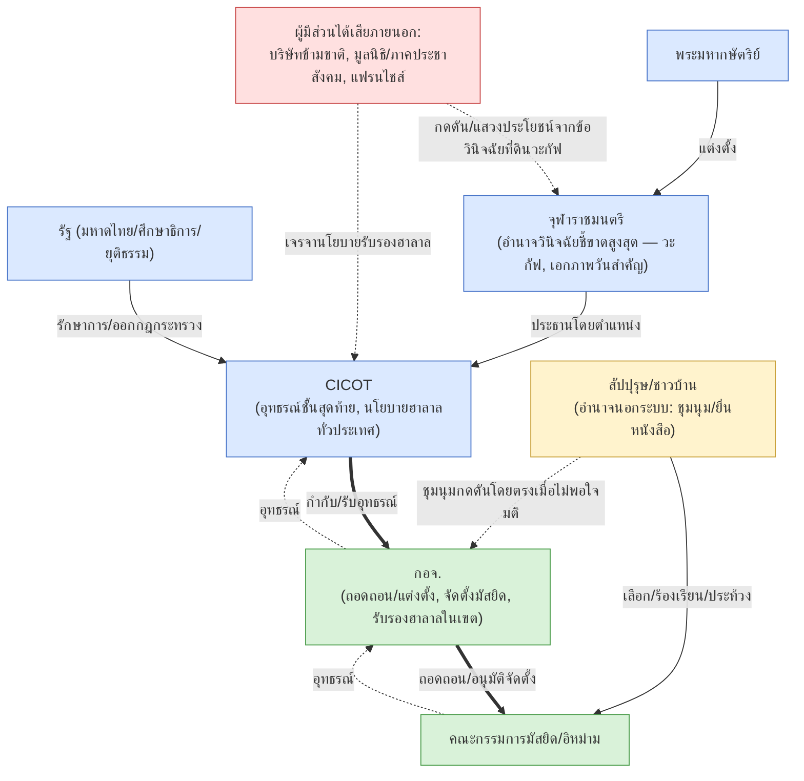

# แผนที่อำนาจ-ความขัดแย้ง-ผู้มีส่วนได้ส่วนเสีย / Conflict & Stakeholder Power Map

> **วัตถุประสงค์**: สังเคราะห์จากกรณีข้อพิพาทจริงที่ ingest แล้วในระบบนี้ (5 กรณี ณ ตอนที่เขียน) เพื่อให้เห็น
> รูปแบบความขัดแย้งที่เกิดซ้ำ ผู้มีส่วนได้ส่วนเสีย และช่องว่างอำนาจ — ใช้เป็นเครื่องมือบริหารจัดการ/คาดการณ์
> ไม่ใช่บทสรุปทางกฎหมายหรือข้อกล่าวหาที่ยืนยันแล้ว (ทุกกรณีอ้างอิงจากข่าว/บทความ ยัง `verified: false`)

## ประเด็นความขัดแย้งที่เกิดซ้ำ (Recurring Conflict Themes)

| ประเด็น | กรณีตัวอย่าง | คู่ขัดแย้งหลัก | จุดชี้ขาด |
|---|---|---|---|
| **วันอีดไม่ตรงประกาศจุฬาราชมนตรี** | มัสยิดบ้านคู/เกาะหมี สงขลา 2562 | อิหม่าม (ยึดการดูดวงจันทร์เอง) ↔ กอจ./มติเอกภาพจังหวัด | กอจ. ถอดถอน → อุทธรณ์ CICOT |
| **ความล่าช้า/ความไม่โปร่งใสในกระบวนการถอดถอน** | มัสยิดกลางฉลุง สตูล 2562 (ล่าช้า 2+ ปี) | ผู้ร้อง/สัปปุรุษ ↔ กอจ. (เพิกเฉย/ล่าช้า) | ยังไม่จบ ณ เวลาที่รายงาน |
| **ย้ายทะเบียนมัสยิด/เอกสารปลอม/ตั้งมัสยิดคู่ขนานชื่อซ้ำ** | มัสยิดกลางฉลุง สตูล | อิหม่ามเดิม (ถูกกล่าวหา) ↔ สัปปุรุษ/กอจ. | รอกระบวนการถอดถอน+อาจถึงชั้นอาญา |
| **อุปสรรคการจดทะเบียนจัดตั้งมัสยิดใหม่** | มัสยิดอัลเอี๊ยะซาน สตูล (ยื่นครั้งที่ 2 หลังตั้งมา 6 ปี) | ชุมชนผู้ก่อตั้ง ↔ กอจ./กฎกระทรวงฉบับที่ 2 | ยังไม่จบ |
| **การวินิจฉัยที่ดินวะกัฟผิดพลาด/ขัดผลประโยชน์บริษัทใหญ่** | ที่ดินวะกัฟ จะนะ สงขลา (ท่อก๊าซไทย-มาเลเซีย) | ชาวบ้าน/ทายาทผู้วะกัฟ ↔ สำนักจุฬาราชมนตรี ↔ บริษัทข้ามชาติ | จุฬาราชมนตรี (ยอมรับผิดพลาดแต่ไม่แก้ไข ปิดสำนักงานหนี) |
| **ทรัพย์สินวะกัฟไม่จดทะเบียนเป็นของส่วนกลาง** | ปอเนาะญิฮาด + รูปแบบทั่วภาคใต้ | ชุมชนผู้บริจาค ↔ ผู้ครอบครองรายบุคคล/ทายาท | ศาลแพ่ง (กรณีปอเนาะญิฮาด: ยึดเป็นของแผ่นดิน) |
| **ขอบเขต/นโยบายรับรองฮาลาล (รายสาขา vs. ทั้งระบบ)** | KFC ไทย | บริษัทแฟรนไชส์ (ไม่ยื่นขอ) ↔ CICOT (เปลี่ยนนโยบายบังคับทั้งระบบ) | ไม่มีข้อยุติ (บริษัทเลือกไม่ต่อ) |

## แผนที่อำนาจเชิงสถาบัน (Power Map)

## ข้อสังเกตเชิงอำนาจ (Power Asymmetry Observations)

1. **สัปปุรุษ/ชาวบ้านมีอำนาจทางการเพียงจำกัด** (เลือกกรรมการ, ยื่นคำร้อง) แต่ใช้**อำนาจนอกระบบ**บ่อยครั้ง (ชุมนุม/ประท้วง/ป้ายผ้า) เมื่อรู้สึกว่ากระบวนการทางการช้า/ไม่เป็นธรรม — พบในทั้งกรณีสงขลาและจะนะ
2. **จุฬาราชมนตรี/สำนักงาน มีอำนาจวินิจฉัยชี้ขาดสูงสุดแต่ขาดกลไกตรวจสอบ/รับผิดที่มีประสิทธิภาพ** — กรณีจะนะแสดงว่าแม้ผู้วินิจฉัยเองยอมรับว่าทำผิดพลาด (ลงพื้นที่ผิด) ก็ยังไม่มีกลไกบังคับให้แก้ไขคำวินิจฉัยอย่างเป็นระบบ
3. **ผู้มีส่วนได้เสียภายนอก (บริษัทข้ามชาติ, แฟรนไชส์) สามารถส่งผลต่อการตัดสินใจขององค์กรศาสนาได้ทางอ้อม** — ทั้งผ่านการอ้างคำวินิจฉัยเพื่อสร้างความชอบธรรมในการดำเนินโครงการ (จะนะ) และผ่านการต่อรองนโยบาย (KFC)
4. **กอจ. เป็นจุดคอขวดที่สุด** — ทั้งอนุมัติจัดตั้งมัสยิดใหม่, ถอดถอนกรรมการ, และรับรองฮาลาล ล้วนผ่าน กอจ. ก่อน แต่กรณีสตูลแสดงว่า กอจ. เองก็สามารถล่าช้า/ไม่ดำเนินการได้นานหลายปีโดยไม่มีบทลงโทษที่ชัดเจน
5. **ข้อกล่าวหาเรื่อง 'มูลนิธิ' หรือกลุ่มภายนอกสร้างความแตกแยก** ปรากฏซ้ำในวาทกรรมของฝ่ายกรรมการ (กอจ.สงขลา) — ยังไม่มีหลักฐานยืนยัน แต่เป็นรูปแบบวาทกรรมที่ควรจับตาว่าใช้บ่อยแค่ไหนเมื่อมีข้อพิพาท

## เอกสารที่ใช้สังเคราะห์

| กรณี | id |
|---|---|
| ถอดถอนอิหม่าม สงขลา+สตูล 2562 | `doc-research-imam-removal-disputes-case-studies-0001` |
| ที่ดินวะกัฟ จะนะ 2551 + ปอเนาะญิฮาด 2559 | `doc-research-waqf-land-disputes-case-studies-0001` |
| KFC ฮาลาล | `doc-research-kfc-halal-provincial-institute-link-0001` |

**ข้อจำกัด**: แผนที่นี้สร้างจากกรณีตัวอย่างที่บังเอิญมีผู้ส่งมาให้ในระบบนี้ ไม่ใช่การสุ่มตัวอย่างที่เป็นระบบ — จำนวนกรณียังน้อย (5 กรณี) ห้ามสรุปเป็นแนวโน้มสถิติทั่วประเทศ ใช้เป็นกรอบตั้งคำถามเมื่อเจอข้อพิพาทใหม่เท่านั้น
