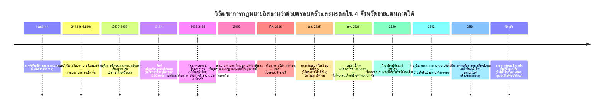
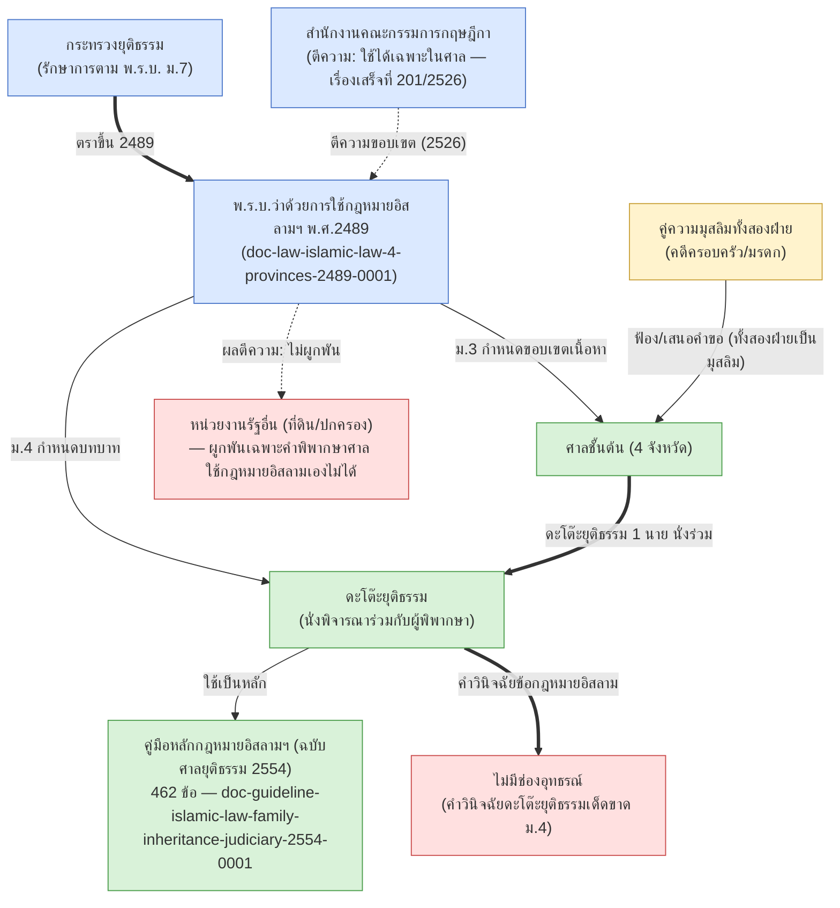

# ระบบยุติธรรมกฎหมายอิสลามใน 4 จังหวัดชายแดนภาคใต้ / The Dato Yuttitham Justice System

> **ขอบเขต**: เอกสารนี้ครอบคลุมเฉพาะระบบ **"ดะโต๊ะยุติธรรม"** — การใช้กฎหมายอิสลามว่าด้วยครอบครัวและมรดก
> ในศาลยุติธรรมของ 4 จังหวัด (ปัตตานี นราธิวาส ยะลา สตูล) ซึ่งเป็นคนละระบบกับสายบริหารองค์กรศาสนาอิสลาม
> (CICOT/กอจ./มัสยิด) ใน `docs/CICOT_STRUCTURE.md` — ทั้งสองระบบเชื่อมกันเพียงบางจุด (ดูหัวข้อ "จุดเชื่อมกับ
> CICOT" ท้ายไฟล์) สังเคราะห์จาก 7 เอกสารที่ ingest แล้วในระบบนี้

## เส้นเวลา / Timeline

**หมายเหตุความคลาดเคลื่อนที่ยังไม่ปิด**: จำนวนปี "ใช้มานาน" ของคู่มือฉบับกระทรวงยุติธรรมก่อนปี 2554 มี 2 ตัวเลข
ขัดกัน — บทความ Isranews บอก "กว่า 70 ปี" (นับจากฉบับ 2484), คำนำฉบับศาลยุติธรรม 2554 เองบอก "กว่า 30 ปี"
(อาจนับจากฉบับปรับปรุง/สัมมนา 2525 ซึ่งยังไม่ยืนยันว่าเป็นฉบับแก้ไขของ 2484 หรือเอกสารคนละชุด — ดู
`doc-other-islamic-law-seminar-1982-0001`)

## DAG เชิงสถาบัน / Institutional DAG

**สีแดง (NoAppeal, ExtraJudicial)** = ช่องว่างเชิงโครงสร้างที่เอกสารหลายฉบับในระบบนี้ (วิทยานิพนธ์ 2529,
คำวินิจฉัยกฤษฎีกา 2526, บทความล่าสุดของสุรเดช บินรามัน) ระบุตรงกันว่ายังไม่ได้รับการแก้ไข

## ประเด็นสำคัญที่ยืนยันแล้วจากหลายแหล่ง (cross-confirmed)

1. **ขอบเขตการบังคับใช้**: กฎหมายอิสลามใช้ได้ **เฉพาะเมื่อคดีขึ้นสู่ศาลแล้ว** ไม่ใช่กฎหมายทั่วไปที่หน่วยงานรัฐ
   อื่นต้องปฏิบัติตามเอง — ยืนยันจากคำวินิจฉัยกฤษฎีกา 201/2526 และตัวบท พ.ร.บ.2489 มาตรา 3-4 เอง
2. **ไม่มีช่องทางอุทธรณ์**: คำวินิจฉัยของดะโต๊ะยุติธรรมในข้อกฎหมายอิสลามเด็ดขาดตามตัวบทกฎหมาย (มาตรา 4)
   — วิทยานิพนธ์ 2529 เสนอให้แก้ไข, บทความปัจจุบันของสุรเดช บินรามันยืนยันว่ายังไม่ถูกแก้ไข (~40 ปีให้หลัง)
3. **สถานะทางกฎหมายของ "กฎหมายอิสลาม" เอง**: ไม่ผ่านกระบวนการสภานิติบัญญัติ เป็นการรวบรวม/แปลกีตาบ
   (นิกายซุนนี มัซฮับซาฟีอี) — พ.ร.บ.2489 เพียง "รับรองสถานะ" ให้ใช้ในศาล ไม่ใช่ตรากฎหมายเนื้อหาเอง
4. **คุณสมบัติ/การคัดเลือกดะโต๊ะยุติธรรม**: พ.ร.บ.2489 **ไม่ได้กำหนดไว้เอง** — ช่องว่างนี้ถูกวิพากษ์ในวิทยานิพนธ์
   2529 ข้อเสนอแนะข้อ 4 — ยังไม่พบเอกสารในระบบนี้ที่ระบุกระบวนการคัดเลือก/แต่งตั้งดะโต๊ะยุติธรรมจริงในปัจจุบัน
5. **ขอบเขตทางภูมิศาสตร์จำกัดเฉพาะ 4 จังหวัด**: มุสลิมนอกเขตปัตตานี/นราธิวาส/ยะลา/สตูล (เช่น กรุงเทพฯ สงขลา)
   ไม่ได้รับสิทธิ์ตาม พ.ร.บ.2489 ต้องใช้อนุญาโตตุลาการ (แต่งตั้งเป็นลายลักษณ์อักษรจาก กอจ.หรือผู้รู้ศาสนา) แทน
   — ไม่เคยขยายขอบเขตเลยตั้งแต่หลักฐานแรก 2444 (>100 ปี) บทความ Prachatai 2552 เรียกภาวะนี้ว่า
   "การเลือกปฏิบัติระหว่างมุสลิมด้วยกันเอง" (doc-research-islamic-law-recommendations-prachatai-2552-0001)
6. **เคยถูกยกเลิกมาก่อน**: รัฐบาลจอมพล ป. พิบูลสงคราม (นโยบายรัฐนิยม) ยกเลิกการใช้กฎหมายอิสลามใน 4 จังหวัด
   ระหว่าง พ.ศ. 2486-2488 ก่อนที่ พ.ร.บ.2489 จะฟื้นฟูสถานะกลับมา — ยังไม่พบเอกสารในระบบนี้ที่อธิบายเหตุผล/
   บริบทของการยกเลิกช่วงนั้นโดยละเอียด (ทราบแค่ช่วงเวลาและนโยบายรัฐนิยมเป็นบริบทกว้างๆ)
7. **ข้อเสนอปฏิรูปซ้ำกันหลายรอบไม่เคยถูกนำไปปฏิบัติ**: คณะกรรมการอิสระเพื่อความสมานฉันท์แห่งชาติ (กอส., 2549),
   วิทยานิพนธ์ 2529, และบทความ Prachatai 2552 ต่างเสนอให้มีประมวลวิธีพิจารณาความ/กฎหมายพยานเฉพาะสำหรับ
   คดีอิสลาม — บทความล่าสุดของสุรเดช บินรามัน (ปัจจุบัน) ยังคงระบุว่าไม่มีอยู่ แสดงว่าไม่มีข้อเสนอใดถูกนำไปปฏิบัติ
   ตลอดช่วง ~40 ปีที่ผ่านมา

## จุดเชื่อมกับ CICOT (ดู docs/CICOT_STRUCTURE.md)

**เท่าที่ตรวจสอบได้ในเอกสารทั้ง 7 ฉบับนี้ ไม่พบมาตราใดที่ให้ CICOT หรือ กอจ. มีบทบาทเป็นทางการในการคัดเลือก/
รับรองคุณสมบัติดะโต๊ะยุติธรรม** — นี่เป็นระบบที่แยกจากสายบริหาร CICOT โดยสิ้นเชิงในทางกฎหมายลายลักษณ์อักษร
แม้ทั้งสองระบบจะเกี่ยวกับกฎหมายอิสลามเหมือนกันและอาจมีบุคคลที่ทับซ้อนกันในทางปฏิบัติ (เช่น ผู้มีความรู้ศาสนา
ที่ได้รับการยอมรับจากชุมชนมุสลิมในพื้นที่) — ถือเป็น**ช่องว่างเปิด**ที่ต้องหาเอกสารเพิ่มเติมมายืนยัน ไม่ใช่ข้อสรุป

## เอกสารที่ใช้สังเคราะห์ไฟล์นี้

| ลำดับเวลา | เอกสาร | id |
|---|---|---|
| 2489 | พ.ร.บ.ว่าด้วยการใช้กฎหมายอิสลามฯ | `doc-law-islamic-law-4-provinces-2489-0001` |
| 2525 | เอกสารสัมมนา กระทรวงยุติธรรม | `doc-other-islamic-law-seminar-1982-0001` |
| 2526 | คำวินิจฉัยกฤษฎีกา 201/2526 | `doc-law-krisdika-opinion-201-2526-0001` |
| 2529 | วิทยานิพนธ์สมบูรณ์ พุทธจักร | `doc-research-islamic-law-4-provinces-thesis-1986-0001` |
| 2554 | คู่มือฉบับศาลยุติธรรม | `doc-guideline-islamic-law-family-inheritance-judiciary-2554-0001` |
| 2567 | บทความ Isranews (ประวัติศาสตร์) | `doc-research-islamic-law-history-isranews-2567-0001` |
| ปัจจุบัน | บทความสุรเดช บินรามัน | `doc-guideline-islamic-procedural-law-article-suradet-0001` |
| 2552 | บทความ Prachatai (ขอบเขตภูมิศาสตร์+เปรียบเทียบต่างประเทศ) | `doc-research-islamic-law-recommendations-prachatai-2552-0001` |

## ตารางเปรียบเทียบต่างประเทศ (อ้างจากบทความ Prachatai 2552, อิงวิทยานิพนธ์ 2529 + หนังสือเด่น โต๊ะมีนา)

| ประเทศ | จำนวนศาลชะรีอะฮ์ | การอุทธรณ์ |
|---|---|---|
| ศรีลังกา | 52 ศาล (ตั้ง ค.ศ.1983) ทั่วประเทศ | ยกเลิกบรรทัดฐานกฎหมายทั่วไปสำหรับมุสลิมโดยเฉพาะ |
| ฟิลิปปินส์ | 51 ศาล (ประจำท้องถิ่น+ประจำภาค) ใน 5 ภาค | อุทธรณ์ได้ถึงศาลฎีกา (ไม่เป็นที่สุดในชั้นภาค) |
| สิงคโปร์ | สำนักทะเบียนสมรส/หย่า/เปลี่ยนศาสนาประจำภาค | คณะกรรมการอุทธรณ์ (Appeal Board) เป็นที่สุด |
| ไทย | 0 ศาลชะรีอะฮ์แยกต่างหาก — ใช้ดะโต๊ะยุติธรรมนั่งร่วมศาลชั้นต้นปกติ 4 จังหวัดเท่านั้น | ไม่มีช่องทางอุทธรณ์คำวินิจฉัยข้อกฎหมายอิสลามเลย (ม.4 พ.ร.บ.2489) |
